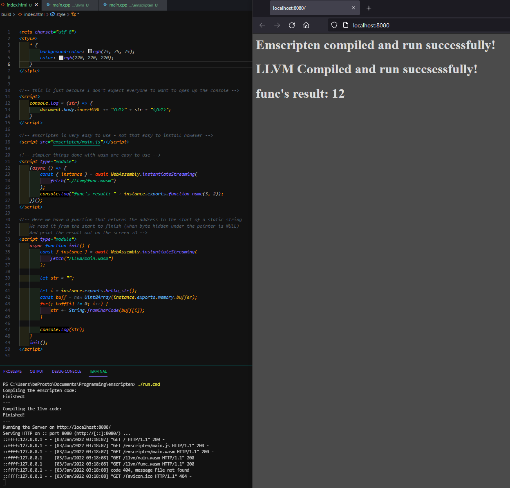

## Trying WASM

WebAssembly is an exciting technology!

In this project I tried 2 solutions for compiling a C/C++ file to WASM.

First being Emscripten, and second being standard LLVM (clang).

To compile and run the project on your own, you're going to have to run the `run.cmd` file.

This is how it looks like finished:

